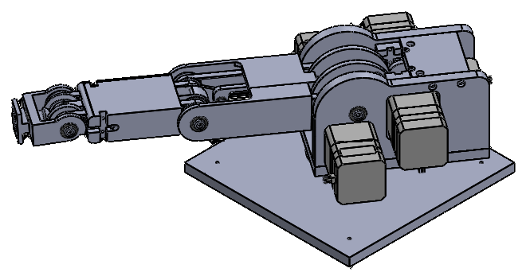
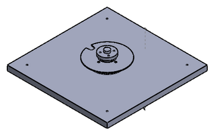
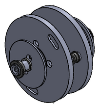
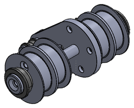
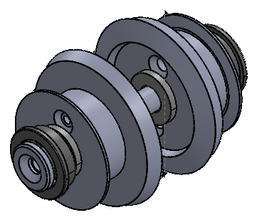
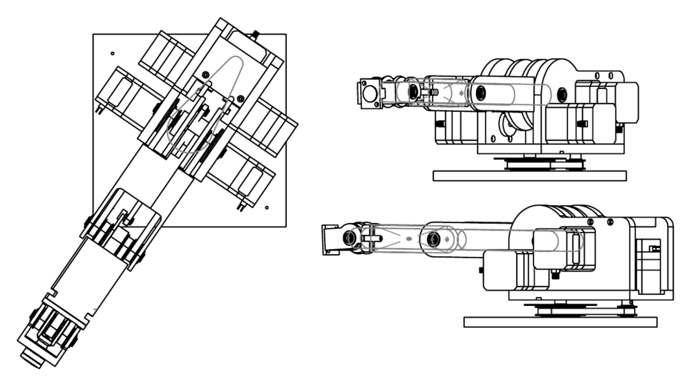
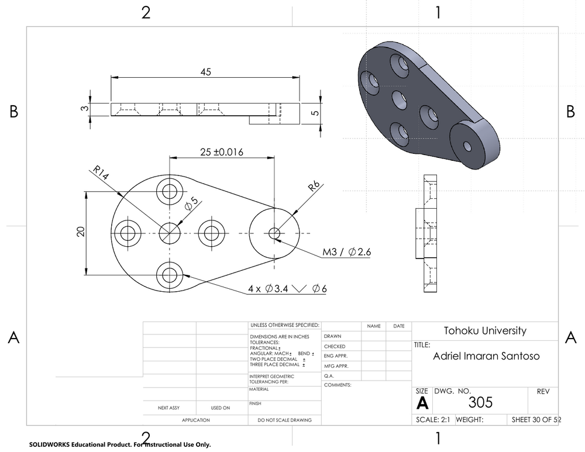
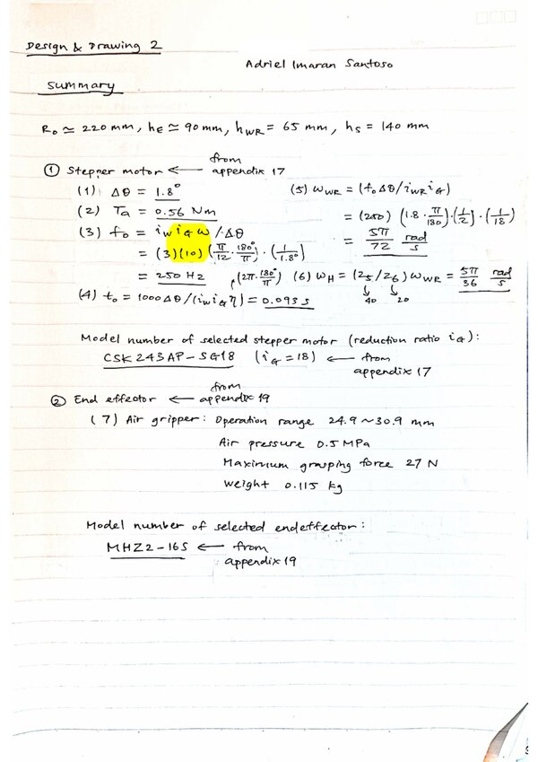

# 3-DOF Robot Manipulator

A robot arm designed, sized and drawn in SOLIDWORKS 2024: 47 parts in five
assemblies, a 52-sheet drawing set and the hand calculations behind the
motor, gear and belt choices.

<p align="center">
  
</p>

Final project for Design and Drawing II, Department of Mechanical and Aerospace
Engineering, Tohoku University (2025). The design follows the course's
specification; the modelling, drawings and calculations are my own.

## Contents

- [The joints](#the-joints)
- [Drawings](#drawings)
- [Design calculations](#design-calculations)
- [Opening the model](#opening-the-model)
- [Repository structure](#repository-structure)
- [Licence and credits](#licence-and-credits)

## The joints

Stepper motors drive each joint through timing belts and gears.

|  |  |  |  |
|:---:|:---:|:---:|:---:|
| Base and waist (`X-X.SLDASM`) | Shoulder (`Ashoulder_joint.SLDASM`) | Elbow (`Belbow_joint.SLDASM`) | Wrist (`Cwrist_joint.SLDASM`) |

The full arm is `cad/assembly.SLDASM`.

## Drawings

`drawings/drawings.pdf` has one sheet per part, then the subassemblies and the
full assembly (52 sheets). Part numbers follow the structure of the arm:

| Numbers | Group | Examples |
|---|---|---|
| 101–108 | Base and waist | base plate, waist rotation plate, toothed pulleys, belt |
| 201–217 | Shoulder | motor plates, spur gears, flange, sleeves, belt |
| 301–309 | Upper arm and elbow | upper arm, lever, link bar, belt |
| 401–404 | Forearm | forearm, shaft, bevel gears |
| 501–502 | Wrist | wrist, shaft |
| 601 | Motor | pulse (stepper) motor |
| 701–706 | Bearings | ball bearings, bearing nut and washer, plain bearing |

<p align="center">
  
</p>
<p align="center"><em>Top, front and side views of the assembly (sheet 52).</em></p>

<p align="center">
  
</p>
<p align="center"><em>A part drawing: the lever, part 305 (sheet 30).</em></p>

## Design calculations

`calculations/calculation_sheet.pdf` (7 pages, handwritten) sizes the drive
train from the course's requirements and its catalogue appendices: link
lengths, motor selection, the operating range of each joint, and the pulleys,
belts and gears.

| Item | Selection (from the calculation sheet) |
|---|---|
| Stepper motor | CSK243AP-SG18: 1.8° step, gearhead ratio 18 |
| End effector | Air gripper MHZ2-16S: 24.9–30.9 mm operating range, 0.5 MPa, 27 N maximum gripping force, 0.115 kg |
| Waist drive | Timing pulleys with 24 and 72 teeth (ratio 3), belt TBN132MXL025 |
| Shoulder and elbow drive | Spur gears, module 0.8 mm, 20° pressure angle, 30 and 90 teeth (ratio 3), belt TBN165MXL025 |

<p align="center">
  
</p>
<p align="center"><em>The summary page.</em></p>

## Opening the model

You need SOLIDWORKS 2024 or newer.

1. Clone or download this repository.
2. The plain bearing (part 706) is a supplier model and is not included here.
   Download NTN's sleeve bearing **R-BRF0505** from the CADENAS PARTcommunity
   catalogue in SOLIDWORKS part format and save it as
   `cad/706plain_bearings.sldprt`. Git ignores that file, so it stays local.
   SOLIDWORKS may ask you to confirm the replacement the first time.
3. Open `cad/assembly.SLDASM`. Keep all files in `cad/` together: the
   assemblies find their parts in the same folder.

## Repository structure

```
3dof-manipulator/
├── cad/                    46 of the 47 parts (.SLDPRT) and 5 assemblies (.SLDASM)
├── drawings/
│   └── drawings.pdf        52-sheet drawing set
├── calculations/
│   └── calculation_sheet.pdf
├── docs/images/            pictures for this README
├── LICENSE
└── README.md
```

## Licence and credits

© 2025 Adriel Imaran Santoso. The models, drawings, calculations and images
are licensed under
[CC BY-NC 4.0](https://creativecommons.org/licenses/by-nc/4.0/) (see
`LICENSE`): you may share and adapt them with credit, but not for commercial
purposes. They were made with the educational edition of SOLIDWORKS, whose
files are marked "For Instructional Use Only", so a non-commercial licence is
the one that fits.

The plain bearing R-BRF0505 is NTN's product; its model comes from the CADENAS
PARTcommunity catalogue and is not redistributed here. The motor, gripper,
pulley, belt and gear model numbers come from the catalogue appendices of the
course material.
